# Enterprise Cloud SaaS Platform (AWS EKS, Terraform & GitOps)


[](https://github.com/features/actions)


[](LICENSE)
[](./.github/dependabot.yml)


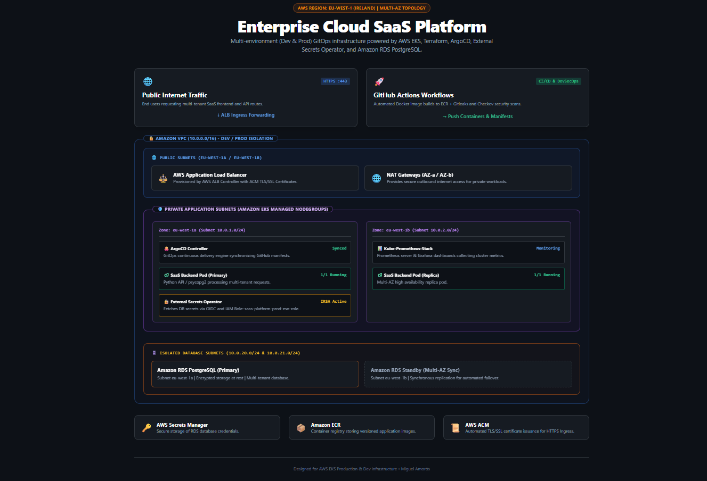

+ A production-grade, multi-environment (**Dev / Prod**) cloud-native SaaS platform built on **Amazon EKS** using **Terraform**, **GitOps (ArgoCD)**, **AWS Secrets Manager**, and **External Secrets Operator (ESO)**.

+ Designed following **DevSecOps** and **FinOps** principles, this infrastructure features complete network isolation within private subnets, automated container building via **GitHub Actions**, dynamic ingress routing through **AWS Load Balancer Controller**, and end-to-end observability using **Kube-Prometheus-Stack & Grafana**.

## Table of contents

- [Architecture Decisions](#architecture-decisions)
- [Infrastructure Verification](#infrastructure-verification)
- [CI/CD & DevSecOps Workflows](#cicd--devsecops-workflows)
- [How to install and run the project](#how-to-install-and-run-the-project)
- [How to use the project](#how-to-use-the-project)
- [Stack](#stack)
- [Status](#status)
- [Author](#author)


## Architecture Decisions

+ **Multi-Environment Isolation:** Separate Terraform state backends and Kubernetes namespaces for dev and prod.
+ **GitOps Continuous Delivery:** ArgoCD continuously monitors and synchronizes the desired cluster state declared in Git with the live Amazon EKS cluster, enforcing declarative deployments.
+ **IRSA (IAM Roles for Service Accounts):** Eliminates static AWS access keys inside the cluster. Kubernetes ServiceAccounts assume fine-grained AWS IAM roles through OpenID Connect (OIDC) and AWS STS.
+ **Automated Secret Lifecycle:** External Secrets Operator (ESO) continuously fetches database credentials from AWS Secrets Manager and maps them directly to native Kubernetes Secrets without manual exposure.
+ **Database Isolation:** Multi-tenant data resides in a managed Amazon RDS PostgreSQL instance placed inside dedicated private database subnets with encrypted storage at rest.
+ **Ingress & Security:** Public access to EKS worker nodes is disabled. The AWS Load Balancer Controller provisions an Application Load Balancer to enforce HTTPS redirection and route incoming external requests.
+ **Automated DevSecOps Pipeline:** Static code analysis, secret scanning (Gitleaks), and container vulnerability assessment (Trivy).
+ **Full Observability & TLS:** Native Prometheus metrics exposure, Grafana dashboards, and automated SSL certificates with Cert-Manager.
+ **Edge Security & SQLi Protection:** AWS WAFv2 WebACL attached to the Application Load Balancer enforcing managed rulesets (AWSManagedRulesCommonRuleSet, AWSManagedRulesSQLiRuleSet) to block Layer 7 attacks in real time.
+ **Network & Audit Observability:** Network traffic is logged via AWS VPC Flow Logs and AWS WAF Logging directly to Amazon CloudWatch Log Groups with automated retention and policy-compliant encryption.
> **Note on Implementation:** The production environment (`prod`) represents the complete end-to-end architecture with full hardening, HTTPS termination, and asynchronous messaging pipelines. The development environment (`dev`) provides a lightweight, cost-optimized baseline for continuous integration.

## Infrastructure Verification

+ **Amazon ECR repositories**
    - ECR dev environment:
    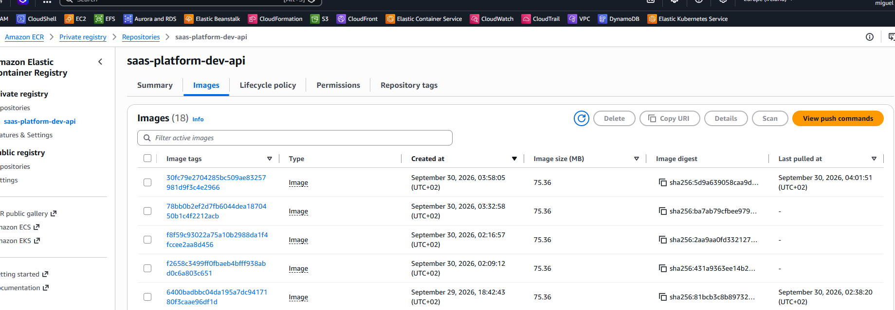

    - ECR prod environment:
    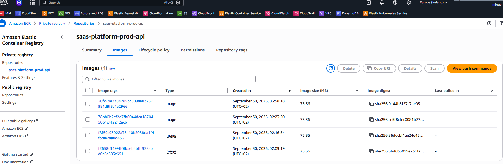

+ **EKS Cluster & NodeGroups**
    - Dev Cluster:
    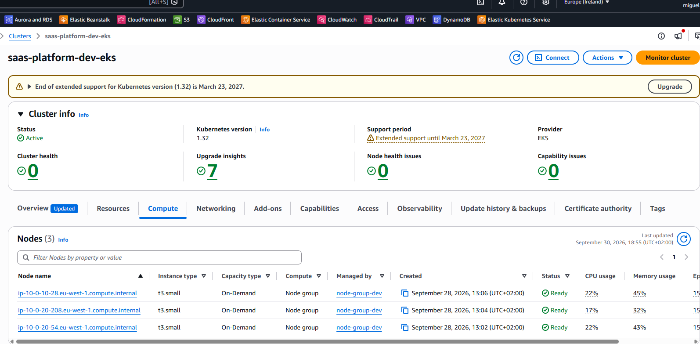

    - Prod Cluster:
    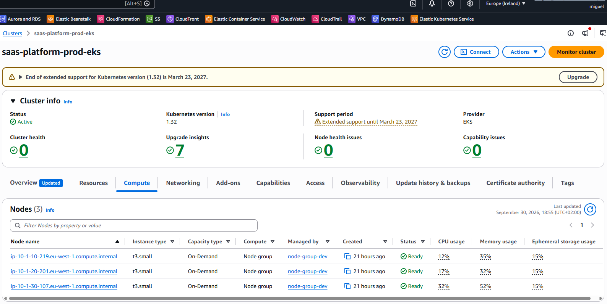

+ **ArgoCD GitOps Sync Status**
    - ArgoCD dev:
    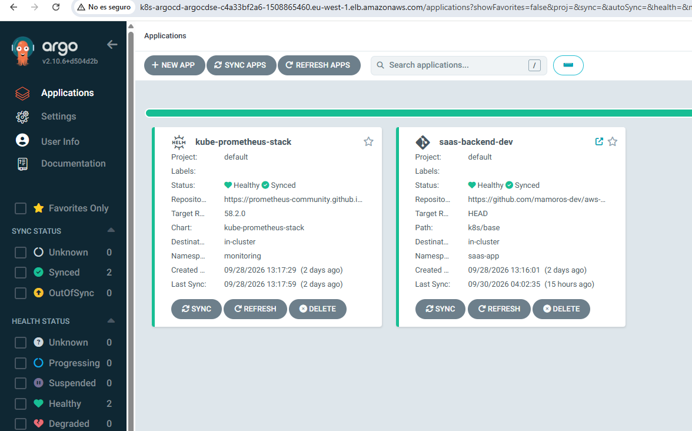

    - ArgoCD prod:
    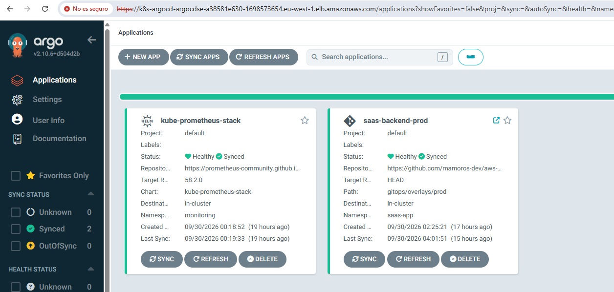

+ **Grafana Dashboard**
    - Dev Dashboard:
    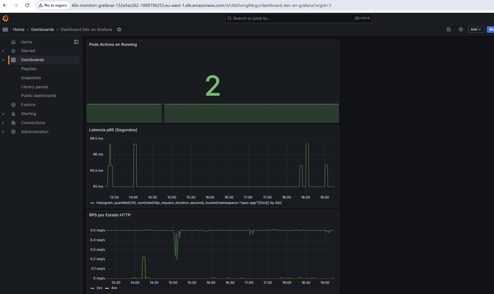

    - Prod Dashboard:
    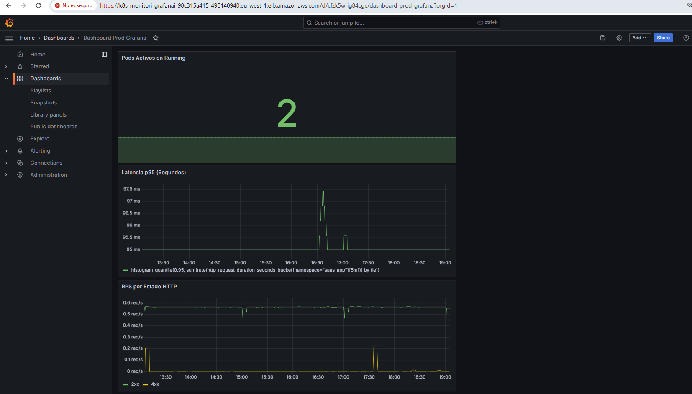

+ **Production SaaS Web Interface (RDS PostgreSQL)**
    - App dev environment:
    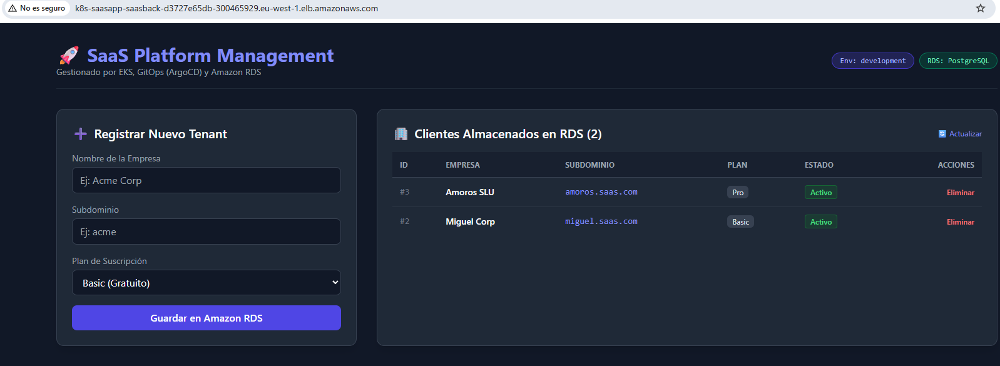

    - App prod environment:
    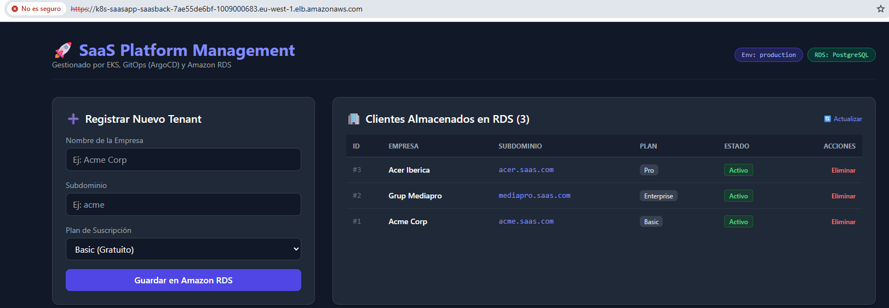


## CI/CD & DevSecOps Workflows

This platform incorporates automated GitHub Actions pipelines located in `.github/workflows/`:

1. **Build & Push Pipeline (`ci.yaml`):** Triggered on code updates. Compiles the Python application, builds the Docker container image, tags it with the commit SHA, pushes it to **Amazon ECR**, and updates Kustomize manifests so ArgoCD automatically rolls out the new version.
2. **DevSecOps Security Scans (`devsecops-scans.yaml`):** Executes automatically on Pull Requests targeting `main` for infrastructure code (`terraform/`, `k8s/`). Runs **Gitleaks** to prevent secret leakage and **Checkov** for IaC static security analysis.

## How to install and run the project

Prerequisites
- AWS CLI configured with appropriate regional permissions.
- Terraform (>= 1.5.0)
- kubectl & Helm installed locally.
- AWS Region: eu-west-1 (Ireland)
> Note on AWS Account ID: Before deploying, ensure you update the eks.amazonaws.com/role-arn annotation in gitops/overlays/prod/external-secrets-sa.yaml with your own AWS Account ID.

#### Step 1: Provision Core Infrastructure (AWS Base)
```bash
cd terraform/environments/dev
or
cd terraform/environments/prod

# Deploy VPC, EKS Cluster and RDS PostgreSQL
terraform init
terraform apply -target=module.vpc -target=module.eks -target=module.rds -auto-approve
terraform apply -auto-approve
```

#### Step 2: Configure EKS Networking & kubectl Context
Connect your local environment to the newly created EKS cluster and enable VPC CNI Prefix Delegation (required to support higher pod density on smaller node instances):
```bash
# Update local Kubeconfig
aws eks update-kubeconfig --region eu-west-1 --name saas-platform-dev-eks
or
aws eks update-kubeconfig --region eu-west-1 --name saas-platform-prod-eks

# Enable VPC CNI Prefix Delegation for EC2 node pod capacity
kubectl set env daemonset aws-node -n kube-system ENABLE_PREFIX_DELEGATION=true
kubectl set env daemonset aws-node -n kube-system WARM_PREFIX_TARGET=1
```

#### Step 3: Deploy Ingress & Platform Controllers
Apply Helm configurations for AWS Load Balancer Controller and ArgoCD:
```bash
# Deploy ALB Controller & ArgoCD via Terraform / Helm
terraform apply -auto-approve

# Retrieve ArgoCD initial admin password (user: admin)
kubectl -n argocd get secret argocd-initial-admin-secret -o jsonpath="{.data.password}" | base64 -d; echo
```

#### Step 4: Bootstrap GitOps Applications (ArgoCD)
Apply the declarative GitOps application manifests to let ArgoCD automatically deploy the SaaS backend, ingress rules, and monitoring stack:
```bash
# 1. Deploy SaaS Application & Database Credentials Store
kubectl apply -f gitops/apps/saas-backend-dev.yaml
or
kubectl apply -f gitops/apps/saas-backend-prod.yaml

# 2. Deploy Monitoring Stack (Prometheus & Grafana)
kubectl apply -f gitops/infrastructure/kube-prometheus-stack/prometheus-stack.yaml

kubectl apply -f gitops/infrastructure/kube-prometheus-stack/grafana-ingress-dev.yaml
or
kubectl apply -f gitops/infrastructure/kube-prometheus-stack/grafana-ingress-prod.yaml

# Retrieve Grafana admin password (user: admin)
kubectl get secret --namespace monitoring kube-prometheus-stack-grafana -o jsonpath="{.data.admin-password}" | ba
```

#### Step 5: Security & Transport Layer Security (TLS)
- **Automated ACM Provisioning:** ArgoCD Ingress dynamically binds to AWS ACM certificates managed via Terraform (`aws_acm_certificate.argocd_acm.arn`).
- **Static Ingress TLS Annotations:** Ingress manifests referencing ACM certificates (such as Grafana) use target annotations (`alb.ingress.kubernetes.io/certificate-arn`).
> **Note for Deployment:** Replace `arn:aws:acm:eu-west-1:123456789012:certificate/...` in `gitops/infrastructure/kube-prometheus-stack/grafana-ingress-prod.yaml` with your own ACM Certificate ARN created in `eu-west-1`.


#### How to Destroy the Infrastructure
To completely tear down all provisioned resources and avoid cloud costs:
```bash
# 1. Strip finalizers from ArgoCD applications to prevent cascade locking
kubectl get application -n argocd -o name 2>/dev/null | xargs -I {} kubectl patch {} -n argocd -p '{"metadata":{"finalizers":null}}' --type=merge 2>/dev/null

# 2. Delete orphaned ArgoCD applications
kubectl delete application --all -n argocd --cascade=orphan --ignore-not-found

# 3. Delete all Ingress resources from all namespaces so that the AWS ALB Controller cleans up the Load Balancers in AWS.
kubectl delete ingress --all -A --ignore-not-found

# 4. Delete ingress & application manifests directly if targeted cleanup is required
kubectl delete -f gitops/infrastructure/kube-prometheus-stack/grafana-ingress-dev.yaml
or
kubectl delete -f gitops/infrastructure/kube-prometheus-stack/grafana-ingress-prod.yaml

kubectl delete -f gitops/apps/saas-backend-dev.yaml
or
kubectl delete -f gitops/apps/saas-backend-prod.yaml

kubectl delete -f gitops/infrastructure/kube-prometheus-stack/prometheus-stack.yaml --ignore-not-found

# 5. Remove application and infrastructure namespaces
kubectl delete namespace saas-app --ignore-not-found
kubectl delete namespace argocd --ignore-not-found
kubectl delete namespace monitoring --ignore-not-found

# 6. Desactivate instance RDS deleted protection
aws rds modify-db-instance \
  --db-instance-identifier saas-platform-prod-db \
  --no-deletion-protection \
  --apply-immediately

# 7. Destroy Terraform Infrastructure
cd terraform/environments/dev
or
cd terraform/environments/prod

terraform destroy -auto-approve
```


## How to use the project

- Retrieve the DNS endpoint generated by the AWS Application Load Balancer:
```bash
kubectl get ingress -n saas-app
```

- Validate health endpoints via cURL (skipping self-signed TLS validation if using default ELB certificates):
```bash
curl -ikL https://<ALB_DNS_NAME>/health
```

- Register and query multi-tenant records directly using Python inside the backend Pod or via the Web Interface:
```bash
kubectl exec -it -n saas-app deployment/saas-backend -- python -c "
import os, psycopg2
conn = psycopg2.connect(
    dbname=os.getenv('DB_NAME'), user=os.getenv('DB_USER'),
    password=os.getenv('DB_PASSWORD'), host=os.getenv('DB_HOST'), port=os.getenv('DB_PORT')
)
cur = conn.cursor()
cur.execute('SELECT id, name, subdomain, plan FROM tenants;')
print(cur.fetchall())
"
```

## Stack
+ **Cloud Provider:** AWS (EKS, RDS PostgreSQL, VPC, Secrets Manager, ALB, IAM, OIDC)
+ **Infrastructure as Code:** Terraform
+ **Container Orchestration:** Kubernetes (EKS)
+ **GitOps & Delivery:** ArgoCD, Kustomize, Helm
+ **Security & Secret Management:** External Secrets Operator (ESO), IRSA
+ **Application Backend:** Python (FastAPI / Flask, psycopg2)
+ **Security & Secret Management:** External Secrets Operator (ESO), IRSA, AWS WAFv2 (WebACL / Layer 7 Security), Gitleaks, Checkov.
+ **Observability & Logging:** Kube-Prometheus-Stack, Grafana, CloudWatch Log Groups (VPC Flow Logs & WAF Logs).

## Status
+ **Completed** — Fully functional IaC and Kubernetes deployment setup ready for production-like evaluation and cloud portfolio demonstration.

## Author
+ Miguel — [GitHub](https://github.com/mamoros-dev) · [LinkedIn](https://www.linkedin.com/in/miguel-amoros-moret/)
